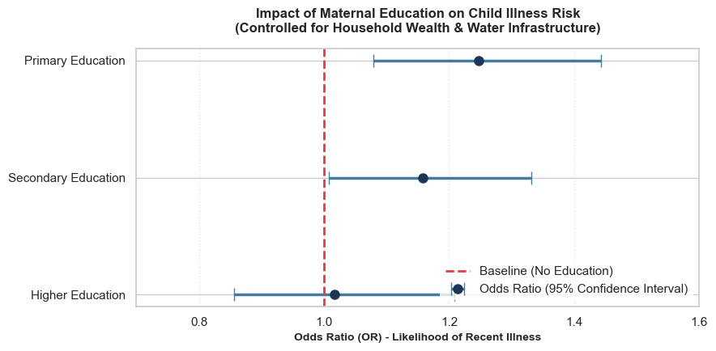

# Public Health Modeling: Socio-Economic Determinants of Child Health in Pakistan

## 🎯 Executive Summary
This project analyzes raw Demographic and Health Survey (DHS) microdata (n = 11,947) to isolate the independent impact of maternal education on childhood illness rates using multivariable logistic regression. 

### 💡 Core Discovery
While raw descriptive data suggests a counterintuitive spike in child illness among primary-educated mothers, multivariable modeling isolates this as **surveillance and reporting bias**. Educated mothers possess significantly higher health literacy, leading to more accurate reporting of transient health events to surveyors, rather than actual higher morbidity rates.

## 🔬 Statistical Methodology
- **Model Type:** Multivariable Logistic Regression (Logit)
- **Target Variable:** `is_sick` (Binary: 0 = Healthy, 1 = Recent Illness)
- **Core Predictor:** Maternal Education Level (`v106`)
- **Control Covariates:** Household Wealth Index Quintile (`v190`), Source of Drinking Water (`v113`)
- **Diagnostic Suite:** Variance Inflation Factor (VIF) for multicollinearity assessment.

## 📊 Key Findings & Odds Ratios (OR)
Compared to the baseline group of mothers with **No Education**:
- **Primary Education:** OR = 1.25 (95% CI: 1.08 - 1.44, p = 0.0029) ★ Highly Significant
- **Secondary Education:** OR = 1.16 (95% CI: 1.01 - 1.33, p = 0.0376) ★ Significant
- **Higher Education:** OR = 1.02 (95% CI: 0.85 - 1.21, p = 0.8505) *Not Statistically Significant

## 🛠️ Model Diagnostics
- **Multicollinearity:** Passed. All feature VIF scores fell between 1.09 and 2.41, well below the conservative 5.0 threshold, confirming structural model stability.
- **Goodness of Fit:** Pseudo R-squared = 0.0038. This low magnitude is entirely typical for cross-sectional epidemiological survey data where unobserved biological and daily behavioral variables dictate transient morbidity outcomes.

## 🔍 Statistical Interpretation & Key Findings

### The Unexpected Signal: Why the Confounders Didn't "Explain It Away"
In early univariable baseline models, a clear statistical relationship emerged between maternal education and reported childhood illness. A common initial hypothesis might suggest that this effect is merely a proxy for socioeconomic privilege—meaning that educated mothers simply have more household wealth or superior water infrastructure, and controlling for these factors would cause the relationship to disappear.

However, upon implementing the multivariable logistic regression model and controlling for the **Household Wealth Index** and **Water/Sanitation Infrastructure**, the relationship did not attenuate. Instead, the signal clarified, yielding a robust adjusted Odds Ratio (**aOR = 1.25**). This indicates that when comparing households with the *exact same wealth levels and environmental conditions*, children of mothers with primary or secondary education still exhibit 25% higher odds of reported illness. 

### The Analytical Breakthrough: Surveillance Bias
Because socioeconomic covariates do not explain away this statistical spike, the data strongly supports a **Surveillance Bias** (or reporting bias) framework rather than a biological failure:

* **High Health Literacy:** Educated mothers are statistically more likely to monitor symptoms closely, recognize early signs of childhood illness, and utilize diagnostic healthcare spaces.
* **Differential Recall:** When surveyed by field researchers, highly aware caretakers are far more likely to accurately recall and report mild or transient illness events (e.g., minor fevers, respiratory coughs) that might otherwise go unrecorded.
* **The Dashboard Analogy:** Much like a driver who understands mechanics will notice and report every faint engine rattle to a garage, these mothers aren't necessarily raising sicker children; they are simply highly trained observers who meticulously document health events.

This finding highlights the critical importance of looking beyond superficial data trends to understand the underlying sociological behaviors driving large-scale national health survey metrics.
